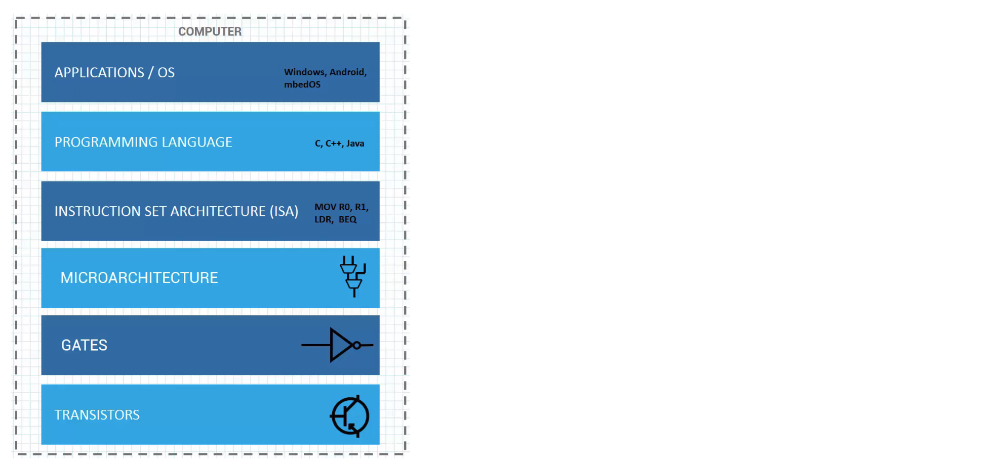

## Computing devices    
   
	   
    
In essence, Computer has a few components, a processor, memory and buses to transfer the data and instructions back and forth between the processor and the memory.    
    
At the lowest level, you have **transistors**, which effectively are just electrons in a tightly controlled fashion to produce switches.   
   
These switches are used to build logic **gates** such as the NOR gate, NAND gate etc.    
    
When we use these gates to build blocks (i.e. **microarchitectures**) like full adders, multipliers, multiplex source, then we have processor architecture (**ISA**), meaning we can specify how we want data to be processed, memory to be controlled and handle outside events such as interrupts.    
    
In fact, the processor then has a **language** on its own (often abstract with higher level language), which instructs various elements, such as the multiplier to perform a task, tell the machine to multiply two floating point numbers and store the results in a register.   
    
And finally, the **operating system** such as Windows, Android and mbedOS, Mac OS X, etc.		


## ARM, Thumb, and Thumb2 Instructions   
    
**ARM** instructions are 32 bit wide (first used in ARM70DMI, ARM9, ARM10, and ARM11)    
    
**Thumb** instructions are subset of ARM, also work on 32 bits data, however 16 bit wide. Fo example, adding two 32 bits numbers together can be done in two ways:   
```asm
# ARM
ADD r0,r0,r2 

# Thumb
ADD r0,r2
```  
   
ARM instruction takes `r0` and `r2` and `ADD` them together, then stores the result back in register `r0`. Hence data contained in those registers, as well as the ARM instruction itself is 32 bit wide.   
The second exmaple using thumb instruction take two operands and instruction are 16 bit altogether (i.e. `r0` acts as both the source and destination register.      
     
**Thumb2** is a subset of the thumb instructions. It includes new 32 bit instructions for more complex operations. Hence it is a combination of both the 16 bit and 32 bits instructions.    
Generally, it is left to the compiler or the assembler to choose the optimal size, but we, as programmers, can force the issue if necessary.     
     
Some process cores, such as the Cortex M3 and M4 only execute the thumb2 instructions. Therefore, there are no ARM instructions at all.

Below are some pre-defined registered names, and most assemblies have a set of registered names that can be used interchangeably in our code, which makes things more readable and understandable. These are the same for ARM assembler.   
     
> [!NOTE]
>  You should note that we can declare our own names just like we can create variable names in C language.		 
    
|                   |		    
|:-----------------:|
| r0-r15 or R0-R15  |
| a1-a4             |
| sp or SP          |
| lr or LR          |
| pc or PC          |
| cpsr or CPSR      | 
| spsr or SPSR      |
| apsr or APSR      |     
    
* a1-a4 registers correspond to r0-r3 (i.e. a1 recognised as r0 and so forth), we write a1-a4 instead of r0-r3 in assembly code for readibility as they denotes argument, result, or scratch registers. 		


## Directives   
    
- They are not instructions.   
- They assist and control the assembly process.   
- They are also called **pseudo-ops**   
    
**.thumb** Assemble code using thumb instruction set.   
**.syntax** Specifies the syntax being used.     
**.cpu** Specifies the cpu being used.   
**.section** Creates a new section.   
**.global** Makes an object accessible from another file.  
**.equ** Gives a symbolic name to numeric value.   
**.end** Indicates the end of a file.   
**.space** Reserves a block of memory and fills it with zeros.   
**.align** Ensures next object aligns properly.	  
**.req** Renames a register (we can still use the original name and a new name).   
**.byte** Allocates one-byte blocks of memory, and specify the initial contents.    
**.hword** Reserves a block of memory and fills it with zero.   
**.word** Allocate four-byte blocks of memory, and specify the initial contents.    
**.quad** Allocate 8 bytes (64 bit) blocks of memory, and specify the initial contents.   


## Operators   
    
These are assembly operators so primitive operations can be performed on data before it is used in an instruction. (These operators apply to the data and are not part of an instruction.)   
    
**Unary** operators used on single values.   
**Binary** operators used on two values and much more common than the unary operators. Binary operators are shown below.		
    
| Keil assembler | GNU assembler |               |
|:---------------|---------------|--------------:|
|  A:MOD:B |  A%B | A modulo B    |
|  A:ROL:B |          | Rotate A left by B bits |
|  A:ROR:B |          | Rotate A right by B bits |
|  A:SHL:B or A<<B |  A<<B  | Shifts A left by B bits |
|  A:SHR:B or A>>B |  A>>B  | Shifts A left by B bits |
| A+B  | A+B  | Add A to B |
| A-B  | A-B  | Substract A from B |
| A:AND:B  | A&B  | Bitwise AND of A and B |
| A:EOR:B  | A^B  | Bitwise exclusive OR of A and B |
| A:OR:B  | A<span>|</span>B  | Bitwise OR of A and B |   		
	
   
	 
    
		